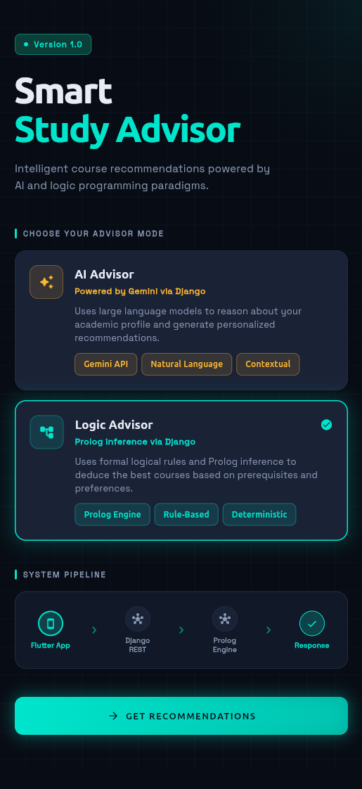
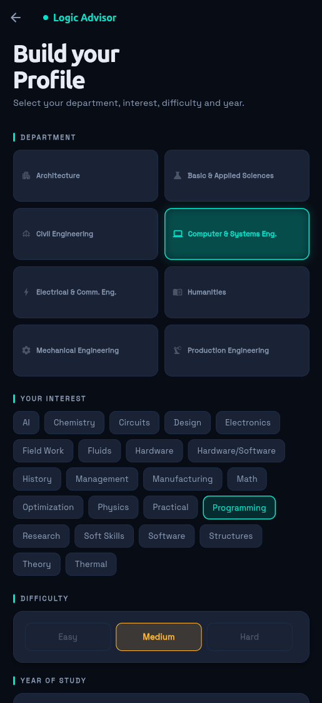
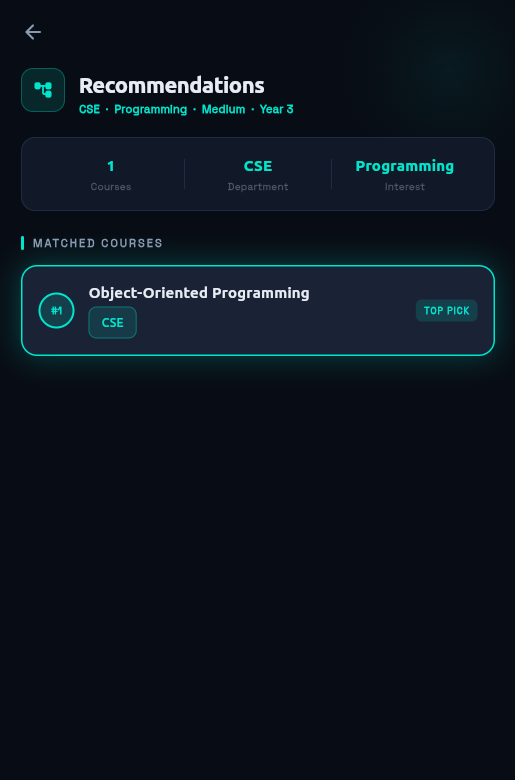

<div align="center">

# 🎓 Smart Study Advisor
### CSE-225 · Programming Languages Paradigms · Lab 3
#### Alexandria University — Faculty of Engineering — Computer & Systems Engineering

<br/>


> An intelligent course recommendation system built with **multiple programming paradigms** —  
> Logic (Prolog), OOP with SOLID, Functional, and Imperative — with an AI-powered alternative via Gemini.

</div>

---

## 📸 Screenshots

> _Add your screenshots here after running the app_

| Home Screen | Advisor Form | Results |
|:-----------:|:------------:|:-------:|
|  |  |  |

<!-- To add screenshots:
  1. Take a screenshot while the app is running
  2. Save them to assets/screenshots/
  3. The table above will render them automatically on GitHub -->

---

## 🎬 Demo Video

### AI (Gemini) + Logic (Prolog) Advisor
[](https://youtube.com/your-link-here)

<!-- Replace the link above with your actual YouTube video URL -->

---

## 📋 Overview

This project implements a **Smart Study Advisor** that recommends university courses to students based on their department, interests, difficulty preference, year of study, and previously completed courses.

The system is built in **two versions**:

| Version | Engine | Description |
|---------|--------|-------------|
| 🤖 **AI Advisor** | Google Gemini 2.5 Flash | Uses a large language model to reason about the student's academic profile and generate contextual recommendations |
| 🧠 **Logic Advisor** | Prolog + PySwip | Uses formal logical rules and a tiered inference engine to deterministically match and rank courses by match percentage |

---

## 🏗️ System Architecture

```
┌──────────────────────────────────────────────────────────────────┐
│                   React Native (Expo) Frontend                   │
│          HomeScreen → AdvisorScreen → ResultsScreen             │
└──────────────────────────┬───────────────────────────────────────┘
                           │  HTTP POST  (JSON arrays)
           ┌───────────────┴────────────────┐
           ▼                                ▼
┌──────────────────────┐      ┌─────────────────────────┐
│   Django REST API    │      │    Django REST API      │
│  POST /recommend/    │      │  POST /recommend/ai/    │
└──────────┬───────────┘      └────────────┬────────────┘
           │                               │
           ▼                               ▼
┌──────────────────────┐      ┌─────────────────────────┐
│  PrologAdvisorService│      │   GeminiAdvisorService  │
│  (OOP + SOLID)       │      │   (OOP + Imperative)    │
└──────────┬───────────┘      └────────────┬────────────┘
           │                               │
     ┌─────┴──────┐                        ▼
     ▼            ▼             ┌─────────────────────────┐
┌─────────┐  ┌──────────┐      │    Gemini 2.5 Flash     │
│ Prolog  │  │  Excel   │      │      (External API)     │
│ Engine  │  │    KB    │      └─────────────────────────┘
│(PySwip) │  │(400 rows)│
└─────────┘  └──────────┘
```

### API Endpoints

| Method | URL | Service | Description |
|--------|-----|---------|-------------|
| `POST` | `/api/recommend/` | `PrologAdvisorService` | Tiered logic-based recommendations via Prolog |
| `POST` | `/api/recommend/ai/` | `GeminiAdvisorService` | AI-based recommendations via Gemini |

### Request Body (both endpoints)
```json
{
  "dept": "CSE",
  "prefs": ["Programming", "AI"],
  "difficulties": ["Easy", "Medium"],
  "years": ["2", "3"],
  "prereqs": ["Mathematics 1 (Calculus)", "Physics 1 (Mechanics)"]
}
```

### Response Shape
```json
{
  "status": "success",
  "total_found": 12,
  "data": [
    {
      "course_name": "Object-Oriented Programming",
      "match_percentage": 100,
      "match_tier": "Tier 1",
      "difficulty": "Medium",
      "prerequisite": "Intro to CSE",
      "preference": "Programming",
      "year_of_study": 2,
      "department": "CSE"
    }
  ]
}
```

---

## 🧩 Paradigms Used

This project is a **paradigms blender** — each layer deliberately uses the paradigm that fits it best.

---

### 🔵 Logic Paradigm — Prolog

**Where:** `advice.pl` — the inference engine  
**Why:** Prolog is purpose-built for rule-based reasoning. Course prerequisites, difficulty levels, and student–course matching are naturally expressed as logical facts and rules — no loops, no mutation, just declarations and unification.

The engine uses **tiered recommend predicates** that progressively relax constraints:

```prolog
% Tier 1 — all parameters must match (100%)
recommend_tier1(Difficulty, Prereq, Preference, Year, Dept, Course) :-
    course(Course, Difficulty, Prereq, Preference, Year, Dept).

% Tier 2 — relax one parameter (e.g., drop Year)
recommend_tier2(Difficulty, Prereq, Preference, _, Dept, Course) :-
    course(Course, Difficulty, Prereq, Preference, _, Dept).

% Tier 3 — relax two parameters (broadest match)
recommend_tier3(Difficulty, _, _, _, Dept, Course) :-
    course(Course, Difficulty, _, _, _, Dept).
```

**Dynamic Fact Injection:** Before querying, the `DataInjectionService` converts incoming Python data into temporary Prolog facts using `assertz`, then cleans up with `retractall` after each request — keeping the engine stateless between requests.

---

### 🟢 OOP Paradigm — Django Services with SOLID

**Where:** `Services/` directory — `BaseAdvisorService`, `PrologAdvisorService`, `CourseRepository`, `RecommendationEngine`, `DataInjectionService`  
**Why:** The system's components (advisors, course data, recommendation logic) map naturally to objects with clear responsibilities.

**SOLID principles applied:**

| Principle | Implementation |
|-----------|---------------|
| **S** — Single Responsibility | `CourseRepository` only fetches data · `RecommendationEngine` only ranks · `DataInjectionService` only translates Python→Prolog |
| **O** — Open/Closed | New advisor types (e.g., a rules-based AI) can be added without modifying `views.py` |
| **L** — Liskov Substitution | `PrologAdvisorService` and `GeminiAdvisorService` are interchangeable through `BaseAdvisorService` |
| **D** — Dependency Injection | `PrologAdvisorService` injects the Prolog instance and `CourseRepository` into `RecommendationEngine` |

```python
# Abstraction — views.py doesn't know which advisor is used
class BaseAdvisorService(ABC):
    @abstractmethod
    def get_recommendations(self, data: dict) -> list:
        pass

class PrologAdvisorService(BaseAdvisorService):
    def get_recommendations(self, data: dict) -> list:
        engine = RecommendationEngine(self.prolog, self.repository)
        return engine.compute_recommendations(data)
```

---

### 🟡 Functional Paradigm — Data Transformation Pipeline

**Where:** `RecommendationEngine.py` and `CourseRepository.py`  
**Why:** Transforming raw Prolog query results into clean, ranked JSON is a **pure data transformation** — no side effects, no shared state. Functional tools like `map()` and `filter()` express this naturally.

**`map()` — extracting prerequisite names:**
```python
# Declaratively transform every Prolog result dict into a plain string
prerequisites = list(map(lambda p: str(p["PreReq"]), query_results))
# Instead of: for p in query_results: prerequisites.append(str(p["PreReq"]))
```

**`filter()` — deduplicating across tiers:**
```python
# Keep only courses not already recommended in a higher tier
unique_courses = list(filter(lambda x: x not in seen_courses, valid_courses))
# One functional step replaces nested loops + manual conditional checks
```

**Why this fits:** Each tier's result is a **pure transformation** of the input — the same query always produces the same output with no mutation of shared state. This makes the pipeline easy to test, compose, and reason about.

---

### 🔴 Imperative Paradigm — Execution Flow & State Control

**Where:** `views.py`, `GeminiAdvisorService.py`, Prolog lifecycle management  
**Why:** Handling HTTP requests, managing the Prolog engine's lifecycle, and calling external APIs require **explicit step-by-step control** — exactly what imperative programming excels at.

**Prolog engine lifecycle (stateful imperative control):**
```python
# Step 1 — inject student facts
self.prolog.assertz(f"student_year({year})")
self.prolog.assertz(f"student_pref('{pref}')")

# Step 2 — run queries
results = list(self.prolog.query("recommend_tier1(Course, Dept)"))

# Step 3 — MUST clean up, or facts leak into next request
self.prolog.retractall("student_year(_)")
self.prolog.retractall("student_pref(_)")
```

**Error handling and control flow:**
```python
# Imperative try/except manages failures at each step independently
try:
    response = gemini_client.generate_content(prompt)
    courses = json.loads(response.text)
except json.JSONDecodeError:
    courses = self._fallback_parse(response.text)
except GoogleAPIError as e:
    return JsonResponse({"status": "error", "message": str(e)}, status=500)
```

---

## 📱 React Native Frontend

### Screens

| Screen | File | Description |
|--------|------|-------------|
| 🏠 Home | `HomeScreen.tsx` | Mode selector (AI vs Logic) with animated SVG grid and pipeline diagram |
| 📝 Advisor Form | `AdvisorScreen.tsx` | Multi-select profile input — department, interests, difficulty, year, courses taken |
| ✅ Results | `ResultsScreen.tsx` | Ranked course cards grouped by match tier (100% → 75% → 50%) |

### File Structure

```
src/
├── screens/
│   ├── HomeScreen.tsx          # Landing — mode selector + pipeline diagram
│   ├── AdvisorScreen.tsx       # Form — dept, prefs, difficulty, year, prereqs
│   └── ResultsScreen.tsx       # Results — tiered cards with match % bars
│
├── models/
│   └── models.ts               # StudentForm · CourseResult · CourseMapper · AppConstants
│
├── services/
│   └── apiService.ts           # ApiService.getLogicRecommendations() / getAiRecommendations()
│                               # Includes NaN sanitizer for Python/pandas JSON quirks
│
├── widgets/
│   └── widgets.tsx             # GlowCard · NeonButton · ChipTag · DifficultyBadge · SectionLabel
│
├── theme/
│   └── theme.ts                # AppColors · AppTypography · AppTheme
│
└── components/
    └── FadeIn.tsx              # Reusable entrance animation wrapper
```

### Design System

| Token | Value | Usage |
|-------|-------|-------|
| Background | `#080C14` Obsidian | Screen backgrounds |
| Surface | `#111827` | Card backgrounds |
| Border | `#1E2D45` | Card borders |
| **Teal** `#00E5CC` | Logic mode accent | Borders, buttons, highlights |
| **Amber** `#FFB830` | AI mode accent | Borders, buttons, highlights |
| Success | `#10D68A` | 100% match, Easy difficulty |
| Warning | `#FFB830` | 75% match, Medium difficulty |
| Error | `#FF4D6A` | Hard difficulty |
| Display font | **Syne ExtraBold** | Headings |
| Body font | **Space Grotesk** | Body text, labels |

### Multi-Select Form Fields

| Field | Type | Sent to API |
|-------|------|-------------|
| Department | Single select (8 options) | `"dept": "CSE"` |
| Interests | Multi-select (23 tags) | `"prefs": ["AI", "Programming"]` |
| Difficulty | Multi-select (Easy/Medium/Hard) | `"difficulties": ["Easy", "Medium"]` |
| Year | Multi-select (Y1–Y5) | `"years": ["2", "3"]` |
| Courses Taken | Multi-select (400 courses, searchable) | `"prereqs": ["Math 1", "Physics 1"]` |

---

## 📊 Tiered Matching System

The Prolog engine queries in three tiers. Django then compares results against the Excel knowledge base to calculate an exact match percentage:

```
Tier 1 — all 5 params match          → match_percentage = 100%
Tier 2 — 4 params match (drop one)   → match_percentage = 75%
Tier 3 — 3 params match (drop two)   → match_percentage = 50%
```

Results are **deduplicated** across tiers (a course that appears in Tier 1 is not repeated in Tier 2), then **sorted descending** by match percentage before being returned to the frontend.

---

## 📦 Knowledge Base

The system covers **400 courses** across **8 departments**:

| Department | Courses |
|------------|---------|
| Architecture | 49 |
| Basic and Applied Sciences | 53 |
| Civil Engineering (CE) | 49 |
| Computer & Systems Engineering (CSE) | 53 |
| Electrical & Communications Engineering (EE) | 50 |
| Humanities | 47 |
| Mechanical Engineering (ME) | 50 |
| Production Engineering (PE) | 49 |

Each course has 5 attributes: `difficulty · prerequisite · preference · year_of_study · department`

Filtered by **23 interest tags:**
`AI · Chemistry · Circuits · Design · Electronics · Field Work · Fluids · Hardware · Hardware/Software · History · Management · Manufacturing · Math · Optimization · Physics · Practical · Programming · Research · Soft Skills · Software · Structures · Theory · Thermal`

---

## 🚀 Setup & Running

### Backend (Django)

```bash
cd backend/
pip install django pyswip google-generativeai openpyxl django-cors-headers python-dotenv
python manage.py runserver
```

Create a `.env` file in the backend root:
```
GEMINI_API_KEY=your_key_here
```

### Frontend (React Native / Expo)

```bash
cd frontend/
npm install
npx expo start
```

Then press:
- `a` — Android emulator
- `i` — iOS simulator  
- `w` — Web browser

### Connecting Frontend to Backend

Open `src/services/apiService.ts` and set the correct IP:

```typescript
// Same machine (web)
const BASE_URL = 'http://127.0.0.1:8000/api';

// Android emulator
const BASE_URL = 'http://10.0.2.2:8000/api';

// Real device (find your PC IP with: ip addr show)
const BASE_URL = 'http://YOUR_PC_IP:8000/api';
```

> **Demo Mode:** If Django is unreachable, the app automatically loads mock data so the UI can be demonstrated independently.

---

## 💭 Reflection

> *If you were building a real AI system, what approach would you choose and why?*

For a real production study advisor, we would **combine both approaches in a hybrid architecture:**

- **Prolog for hard constraints** — prerequisites, credit hours, and graduation requirements are non-negotiable rules that must be enforced exactly. Prolog's declarative logic makes these rules easy to read, audit, and update without touching application code.

- **LLM for soft recommendations** — understanding a student's long-term goals, suggesting electives, explaining *why* a course is recommended, and handling natural language input. LLMs excel at nuanced, context-aware suggestions that rigid rule engines cannot capture.

- **Excel/database as single source of truth** — keeping the knowledge base in a structured format that both the Prolog engine and the AI can query ensures consistency across both recommendation paths.

The hybrid approach gives you the **verifiability of logic** with the **flexibility of AI** — neither alone is sufficient for a system that students depend on for their academic careers.

---

## 👥 Team

| Role | Responsibility |
|------|---------------|
| 🎨 **Frontend Engineer** | React Native app — screens, UI/UX, API integration, multi-select form |
| ⚙️ **Backend Engineer** | Django REST API — views, OOP service architecture, Excel KB integration |
| 🧠 **Logic Programmer** | Prolog inference engine — tiered rules, facts, dynamic injection |
| 🤖 **AI Integrator** | Gemini API — prompt engineering, response parsing, fallback handling |

---

<div align="center">

**CSE-225 · Programming Languages Paradigms · Lab 3**  
Alexandria University — Faculty of Engineering — Computer & Systems Engineering

</div>